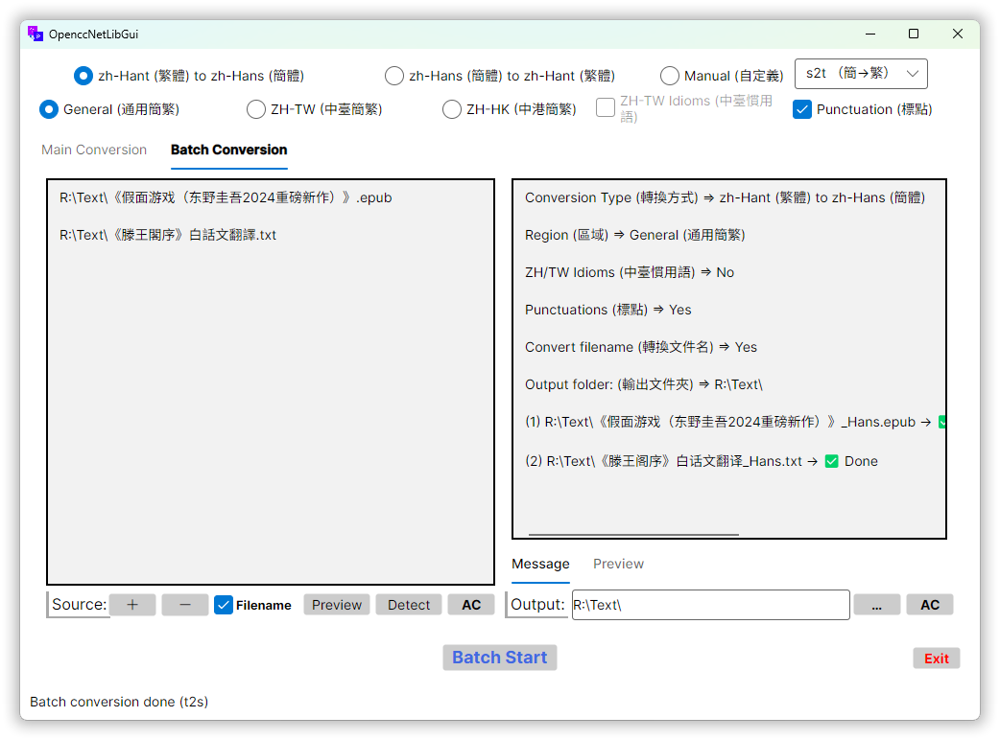

# OpenccNetLibGui

[](https://github.com/laisuk/OpenccNetLibGui/releases/latest)
[](https://github.com/laisuk/openccnetlibgui/releases)
[](https://github.com/laisuk/openccnetlibgui/releases/latest)


**OpenccNetLibGui** is a Chinese text conversion application built with Avalonia and the MVVM design pattern. It
leverages the [OpenccNetLib](https://www.nuget.org/packages/OpenccNetLib) library to provide simplified and traditional
Chinese conversion.

## 🚀 Download

Download the latest version of **OpenccNetLibGui** for your platform:

- 💻 *
  *[Windows (win-x64)](https://github.com/laisuk/OpenccNetLibGui/releases/latest/download/OpenccNetLibGui-v1.1.0-win-x64.zip)
  **
- 🐧 *
  *[Linux (linux-x64)](https://github.com/laisuk/OpenccNetLibGui/releases/latest/download/OpenccNetLibGui-v1.1.0-linux-x64.tar.gz)
  **
- 🍎 *
  *[macOS (osx-x64)](https://github.com/laisuk/OpenccNetLibGui/releases/latest/download/OpenccNetLibGui-v1.1.0-osx-x64.tar.gz)
  **

> 📦 These are **framework-dependent builds**, targeting `.NET 8`.  
> You must have [.NET Runtime 8.0](https://dotnet.microsoft.com/en-us/download/dotnet/8.0/runtime) installed to run
> them.

## Features

- **Chinese Conversion**  
  Convert text between Simplified and Traditional Chinese using optimized OpenCC lexicons and FMM-based dictionary
  matching.

- **Single / Batch Conversion**  
  Perform conversion on individual files or entire folders in one operation.

- **Wide File Format Support**  
  Designed to convert most **text-based file types**, including:
    - Plain text (`.txt`)
    - Subtitles (`.srt`, `.vtt`, `.ass`, `.ttml2`)
    - **Office documents** (`.docx`, `.xlsx`, `.pptx`, `.odt`)
    - **EPUB** (`.epub`)
    - **PDF** (`.pdf`) with intelligent CJK reflow

- **PDF Extraction & CJK Reflow (New in v1.0.1)**  
  Import PDF files and automatically:
    - Extract text using PdfPig
    - Remove irrelevant page headers/footers (configurable)
    - Merge lines broken across pages (e.g., `面` + `容` → `面容`)
    - Preserve titles and chapter headers (`序章`, `第一章》`, etc.)
    - Produce clean, novel-style flowing text for conversion

- **Drag & Drop Support**  
  Drop text, PDF, EPUB, or Office files directly into the Source panel.

- **CJK-Aware Reflow Engine**  
  Smart handling of:
    - Paragraphs
    - Chapter markers
    - Chinese punctuation
    - Page break artifacts
    - Indentation heuristics

- **Cross-Platform Avalonia GUI**  
  Runs consistently on Windows, macOS, and Linux with modern MVVM architecture.

### Notes

- **PDF Support**  
  Only **text-embedded PDF files** are supported.  
  ZhoConverterGui relies on PDF text extraction engines (PdfPig or Pdfium) to read Unicode text directly from the PDF
  content stream.  
  Scanned PDFs or image-based PDFs (pure bitmap pages without embedded text) **are not supported**.  
  To process such files, OCR (Optical Character Recognition) would be required — which is **not included** in this
  version.

- **PDF Extraction Engines**  
  ZhoConverterGui provides two PDF text-extraction engines:
    - **PdfPig** – a fast, pure-managed engine suitable for most standard text-embedded PDFs.
    - **Pdfium (native)** – an enhanced engine offering higher Unicode accuracy and better handling of complex CJK
      layouts and tricky page structures.

  You can switch between these engines in the application settings.

- **CJK Paragraph Reflow**  
  The CJK Paragraph Reflow feature is designed as a **lightweight readability enhancement** for text extracted from PDFs
  and EPUBs.  
  It merges broken lines, reconstructs dialogue, identifies headings, and removes common page-level artifacts to produce
  cleaner, easier-to-read text.

  This feature is **not intended for professional publishing, article preparation, typesetting, or print-ready layout
  work**.  
  Reflowed text should be treated as a **draft-quality starting point**, and users are encouraged to perform **manual
  review and formatting** if the content is intended for editing, distribution, or publication.

## Dependencies

- [Avalonia](https://avaloniaui.net/): Cross-platform .NET UI framework.
- [AvaloniaEdit](https://github.com/AvaloniaUI/AvaloniaEdit): Text editor for Avalonia with virtualization support.
- [OpenccNetLib](https://github.com/laisuk/OpenccNet): .NET library for conversions between Traditional and Simplified
  Chinese.
- [Newtonsoft.Json](https://www.newtonsoft.com/json): High-performance JSON framework for .NET.

## Getting Started

1. **Clone the repository**:

```bash
git clone https://github.com/laisuk/OpenccNetLibGui.git
```

2. **Navigate to the project directory**:

```bash
cd OpenccNetLibGui
```

3. **Restore dependencies**:

```bash
dotnet restore
```

4. **Build the project**:

```bash
dotnet build
```

5. **Run the application**:

```bash
dotnet run
```

## Usage

### Single Mode


Support most **text base** file types.

1. Paste the text or open a file you wish to convert (file/text drag and drop are supported on Windows and macOS).
2. Select the desired conversion configuration (e.g., Simplified to Traditional).
3. Click the **Process** button to see the results.

---

### Batch Mode


Support most **text base** file types, **Office documents** (`.docx`, `.xlsx`, `.pptx`, `.odt`, `.ods`, `.odp`) and
EPUB (`.epub`).

1. Select or drag file(s) into the source list box (File(s), drag and drop currently only supported on Windows and
   macOS).
2. Select the desired conversion configuration.
3. Set the output folder.
4. Click the **Batch Start** button to begin batch conversion.

### Custom Dictionary

Usage of custom dictionary can be set in `LanguageSettings.json`:

```json
{
  "dictionary": "dicts"
}
```

Options are:

1. `"dicts"` - _*.txt_ in directory `dicts`
2. `"json"` - _dictionary_maxlength.json_
3. `"cbor"` - _dictionary_maxlength.cbor_
4. None of above, default to `"zstd"` - _dictionary_maxlength.zstd_

---

### Custom Chinese Language in UI Settings (繁體界面 / 简体界面)



Custom Chinese Language in UI can be set in `LanguageSettings.json`:

```json
{
  "Locale": 1
}
```

Options are:

1. `1` - Traditional Chinese (繁體字)
2. `2` - Simplified Chinese (简体字)
3. Other values - Reset to Simplified Chinese (简体字)

---

## Contributing

Contributions are welcome! Please fork the repository and submit a pull request for any enhancements or bug fixes.

## License

This project is licensed under the MIT License. See the [LICENSE](./LICENSE) file for details.

## Acknowledgements

- [OpenCC](https://github.com/BYVoid/OpenCC) for the Chinese text conversion lexicon.
- [OpenccNet](https://github.com/laisuk/OpenccNet) for the .NET Chinese conversion library.
- [Avalonia](https://avaloniaui.net/) for the cross-platform UI framework.
- [AvaloniaEdit](https://github.com/AvaloniaUI/AvaloniaEdit) for the text editor with virtualization.
- [Newtonsoft.Json](https://www.newtonsoft.com/json) for JSON parsing.
