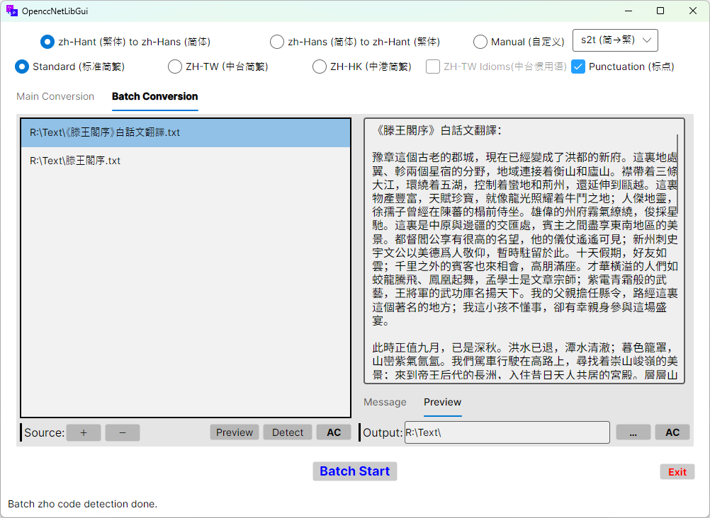
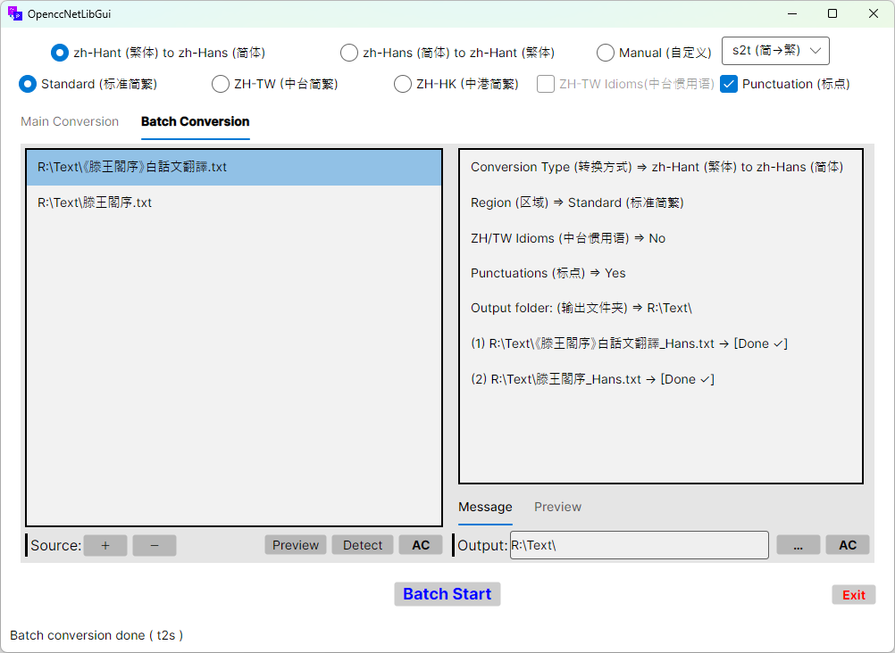

# OpenccNetLibGui

[](https://github.com/laisuk/OpenccNetLibGui/releases/latest)
[](https://github.com/laisuk/openccnetlibgui/releases)
[](https://github.com/laisuk/openccnetlibgui/releases/latest)


**OpenccNetLibGui** is a Chinese text conversion application built with Avalonia and the MVVM design pattern. It
leverages the [OpenccNetLib](https://www.nuget.org/packages/OpenccNetLib) library to provide simplified and traditional
Chinese conversion.

## 🚀 Download

Always get the **latest version** of `OpenccNetLibGui` from the GitHub Releases page:

- 🔖 **[Latest release (all platforms)](https://github.com/laisuk/OpenccNetLibGui/releases/latest)**

On the release page, look for assets named:

- `OpenccNetLibGui-vX.Y.Z-win-x64.zip` – **Windows (win-x64)**
- `OpenccNetLibGui-vX.Y.Z-linux-x64.tar.gz` – **Linux (linux-x64)**
- `OpenccNetLibGui-vX.Y.Z-osx-arm64.tar.gz` – **macOS (Apple Silicon, osx-arm64)**

> 📦 These are **framework-dependent builds** targeting **.NET 10** (starting from **v1.4.0**).
> The **.NET 10 Runtime** must be installed on your system to run these builds:  
> [.NET 10 Runtime](https://dotnet.microsoft.com/en-us/download/dotnet/10.0/runtime)

## Features

- **Chinese Conversion**  
  Convert text between Simplified and Traditional Chinese using optimized OpenCC lexicons combined with an efficient
  FMM-based dictionary matcher.

- **Single & Batch Conversion**  
  Convert individual files or entire directories in one operation.

- **Wide File Format Support**  
  Supports most **text-based file types**, including:
    - Plain text (`.txt`, `.md`)
    - Subtitles (`.srt`, `.vtt`, `.ass`, `.ttml2`)
    - **Office documents** (`.docx`, `.xlsx`, `.pptx`, `.odt`)
    - **EPUB** (`.epub`)
    - **PDF** (`.pdf`) with intelligent CJK text reflow

- **PDF Extraction & CJK Reflow**  
  Import PDF files and automatically:
    - Extract text using **PdfPig** or **Pdfium**
    - Remove repetitive headers and footers (optional)
    - Merge broken lines across pages (e.g., `面` + `容` → `面容`)
    - Preserve chapter titles and headings
    - Produce clean, continuous text suitable for reading or conversion

- **Drag-and-Drop Support**  
  Drop text, PDF, EPUB, or Office files directly into the Source panel.

- **CJK-Aware Reflow Engine**  
  Smart handling of:
    - Paragraph boundaries
    - Chapter markers (`第一章`, `序章`, etc.)
    - Chinese punctuation
    - Page-break artifacts
    - Indentation and spacing heuristics

- **Cross-Platform Avalonia GUI**  
  Modern MVVM-based UI that runs consistently on **Windows**, **macOS**, and **Linux**.

---

## Notes

### **PDF Support**

Only **text-embedded PDFs** are supported.  
`OpenccNetLibGui` reads Unicode text directly from the PDF content stream using either `PdfPig` or `Pdfium`.

❌ Scanned PDFs or pure image-based PDFs **are not supported**.  
Such files require OCR (Optical Character Recognition), which is **not included** in this application.

---

### **PDF Extraction Engines**

`OpenccNetLibGui` offers two selectable engines for PDF text extraction:

- **PdfPig**  
  A pure-managed, cross-platform engine suitable for most standard text-embedded PDFs.

- **Pdfium (native)**  
  A high-accuracy native engine with superior handling of:
    - CJK characters
    - complex layouts
    - overlapping glyphs
    - repeated text tokens
    - tricky multi-column or multi-page flows

The preferred engine can be changed in the **Settings** menu.

---

### **CJK Paragraph Reflow**

The CJK paragraph reflow module is designed as a **lightweight readability enhancement** for extracted `PDF/EPUB`
text.  
It provides:

- Line merging
- Dialogue reconstruction
- Chapter heading detection
- Removal of common page-level artifacts

Reflowed text aims for **cleaner, novel-style readability**, but **is not intended for:**

- professional publishing
- academic typesetting
- print-ready layout
- high-precision editorial work

Users should consider reflowed output as a **draft-quality starting point**, and perform manual review if the content
will be published or redistributed.

---

## Dependencies

- **[Avalonia](https://avaloniaui.net/)**  
  Cross-platform .NET UI framework used to build the application’s user interface.

- **[AvaloniaEdit](https://github.com/AvaloniaUI/AvaloniaEdit)**  
  A performant text editor control with syntax-highlighting, line numbers, and virtualization support.

- **[OpenccNetLib](https://github.com/laisuk/OpenccNet)**  
  Core conversion engine providing optimized OpenCC dictionary handling, FMM segmentation and multi-stage dictionary
  pipelines for Simplified/Traditional conversion.

- **[Newtonsoft.Json](https://www.newtonsoft.com/json)**  
  High-performance JSON serialization/deserialization library used for settings, layout recovery,  
  and application configuration files.

- **[UglyToad.PdfPig](https://github.com/UglyToad/PdfPig)**  
  A fully managed PDF text extraction library used for:
    - Parsing PDF structure
    - Extracting raw Unicode text
    - Fallback extraction when PDFium is unavailable  
      Ideal for CPU-only scenarios or when using a 100% managed dependency chain.

- **PDFium (native library + .NET binding)**  
  High-performance native PDF rendering & text extraction engine used for:
    - Faster page loading on large PDFs
    - More accurate CJK character extraction
    - Improved handling of rotated text, clipped glyphs, and embedded fonts  
      Provides the “fast mode” when users choose **PDFium** in PDF Engine settings.

---

## Getting Started

1. **Clone the repository**:

```bash
git clone https://github.com/laisuk/OpenccNetLibGui.git
```

2. **Navigate to the project directory**:

```bash
cd OpenccNetLibGui
```

3. **Restore dependencies**:

```bash
dotnet restore
```

4. **Build the project**:

```bash
dotnet build
```

5. **Run the application**:

```bash
dotnet run
```

## Usage

### Single Mode


#### PDF Text Extraction (Text-Embedded PDF) and conversion


Support most **text base** file types, OpenDocuments (`DOCX`, `ODT`, `EPUB`) and **Text-Embedded PDF documents**.

1. Paste the text or open a file (text, DOCX, ODT, EPUB or PDF file) you wish to convert (file/text drag and drop are
   supported on
   Windows and macOS).
2. Select the desired conversion configuration (e.g., Simplified to Traditional).
3. `PDF options` can be set in reight-click context menu.
4. Click the **Process** button to see the results.

#### Notes

PDF Engine can be set in `LanguageSettings.json` as well:
Where:  
`1` = `PdfPig`, `2`= `Pdfium`

```json
{
  "pdfEngine": 1
}
```

---

### Batch Mode




Support most **text base** file types, **Office documents** (`.docx`, `.xlsx`, `.pptx`, `.odt`, `.ods`, `.odp`), EPUB (
`.epub`) and **PDF** (`.pdf`, introduced in `OpenccNetLibGui` v1.3.2).

1. Select or drag file(s) into the source list box (File(s), drag and drop currently only supported on Windows and
   macOS).
2. Select the desired conversion configuration.
3. Set the output folder.
4. For **PDF document** conversion, **right-click** List Box to set `PDF Options`. (`PDF engine`, `add page header`,
   `auto-reflow CJK text` etc.)
5. Click the **Batch Start** button to begin batch conversion.

### Dark Theme


`OpenccNetLibGui` is **Dark Theme Mode** friendly.

---

### Custom Dictionary

Usage of custom dictionary can be set in `LanguageSettings.json`:

```json
{
  "dictionary": "dicts"
}
```

Options are:

1. `"dicts"` - _*.txt_ in directory `dicts`
2. `"json"` - _dictionary_maxlength.json_
3. `"cbor"` - _dictionary_maxlength.cbor_
4. None of above, default to `"zstd"` - _dictionary_maxlength.zstd_

---

### Custom Chinese Language in UI Settings (繁體界面 / 简体界面)


Custom Chinese Language in UI can be set in `LanguageSettings.json`:

```json
{
  "Locale": 1
}
```

Options are:

1. `1` - Traditional Chinese (繁體字/傳統漢字)
2. `2` - Simplified Chinese (简体字)
3. Other values - Reset to Simplified Chinese (简体字)

---

## Contributing

Contributions are welcome! Please fork the repository and submit a pull request for any enhancements or bug fixes.

## License

This project is licensed under the MIT License. See the [LICENSE](./LICENSE) file for details.

## Acknowledgements

- **[OpenCC](https://github.com/BYVoid/OpenCC)**  
  For providing the high-quality Chinese conversion lexicons.
- **[OpenccNet](https://github.com/laisuk/OpenccNet)**  
  For the optimized .NET implementation of OpenCC used as the core engine.
- **[Avalonia](https://avaloniaui.net/)**  
  For the modern, cross-platform UI framework powering the application.
- **[AvaloniaEdit](https://github.com/AvaloniaUI/AvaloniaEdit)**  
  For the performant text editor component with line numbers and virtualization.
- **[Newtonsoft.Json](https://www.newtonsoft.com/json)**  
  For the robust and flexible JSON serialization and configuration handling.
- **[PdfPig](https://github.com/UglyToad/PdfPig)**  
  For the fully-managed PDF text extraction engine used in the standard extraction mode.
- **PDFium (native library + .NET bindings)**  
  For providing high-performance PDF rendering and fast CJK text extraction in Pdfium mode.

